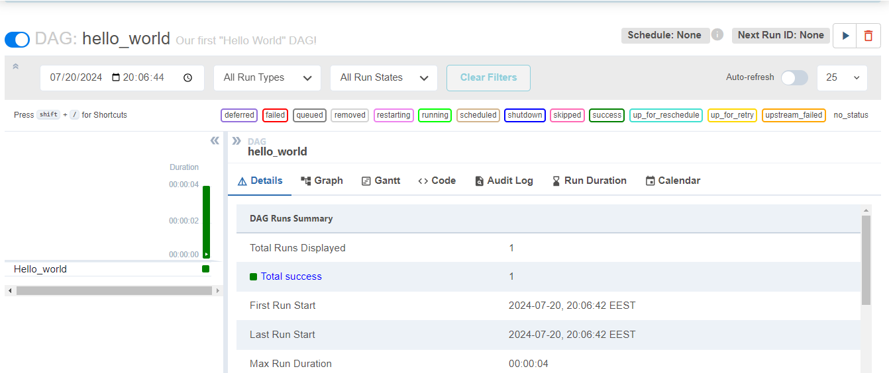
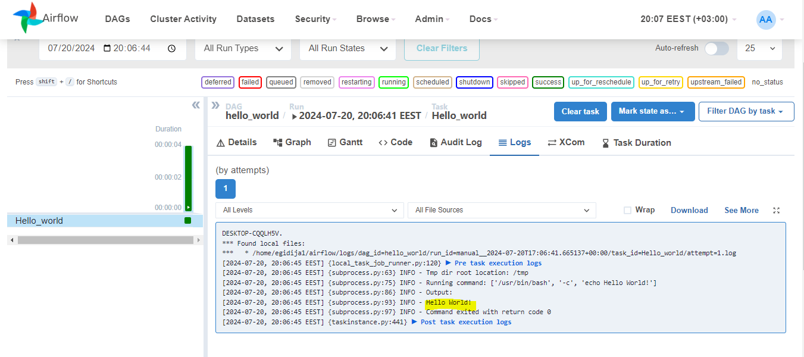
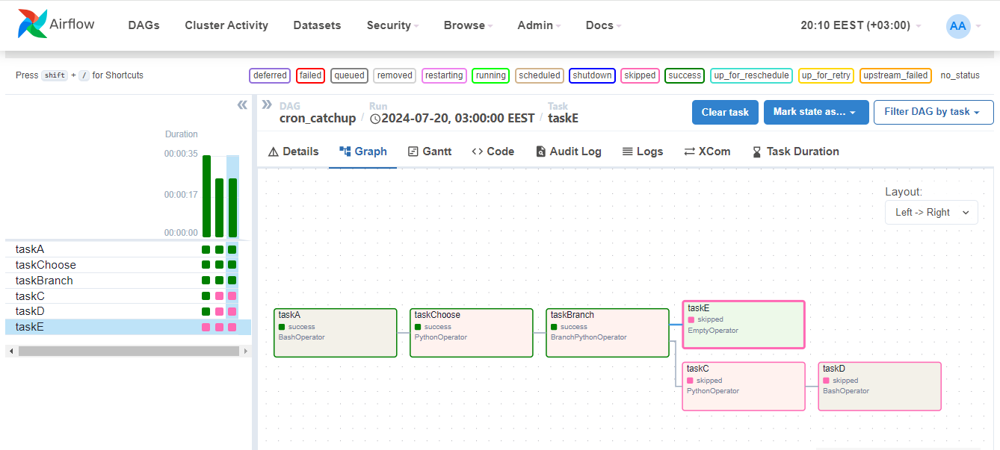
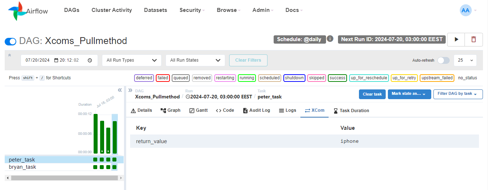

# Airflow Learning Projects

This repository contains a collection of Airflow DAGs that I've built while following tutorials from Astronomer Academy and LinkedIn Learning. Some DAGs have been modified to explore concepts further/fixing small mistakes. All DAGs have been tested locally using the Airflow UI.

Explored concepts:
* As at the very beginning decorators syntax was not not very easy to understand, so I rewrote Astronomer's [DAG](https://academy.astronomer.io/path/airflow-101/astro-runtime-xcoms-101/1189671) using traditional syntax which requires explicit retrieval of XCom values using the pull method. This is in contrast to decorator syntax, which may handle XCom transfers implicitly. 
Please refer to Airflow_DAGs\Intermediate_dags\Xcom_PyOp_Pull.py

Corrections made:
* In the "Create Variable" video on Astronomer's Academy, the value of the variable is written as {"param": "[100, 150, 200]"}, which is incorrect and should be written as: {"param": [100, 150, 200]}.

Other observations:
* The LinkedIn Learnings instructor uses Xcoms to pass a dataframe containing 1350 records. However, this is not recommended in Airflow documentation as Xcoms are designed for small amounts of data. 
Example: Intermediate_dags\Branched_DAGs\Linkedin_courses\branching_with_variables.py

**Structure:**

The repository is organized by difficulty level:
* beginner: Basic Airflow concepts and tasks ("Hello World!" dag, Python operator, Bash Operator, validating and transforming data etc.)
* intermediate: More advanced concepts like defining dependencies, XComs exchange for data usage, creating and using variables, branching.

**Technologies:**

* Airflow
* Python

**Learning Resources:**

* [Astronomer Academy](https://academy.astronomer.io/path/airflow-101) 
* LinkedIn Learning:
    [learning-apache-airflow](https://www.linkedin.com/learning/learning-apache-airflow)
    [apache-airflow-essential-training](https://www.linkedin.com/learning/apache-airflow-essential-training)

Screenshots from the Airflow UI:

Hello World! DAG:

Branched DAG example:

Retrieved Xcom value:
